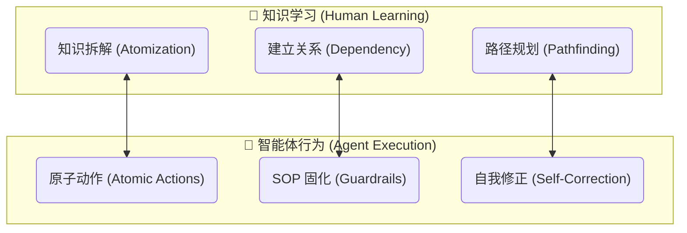
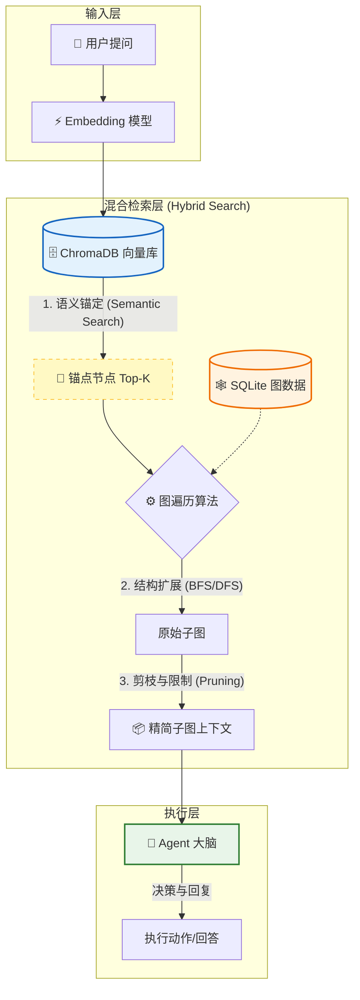

# CogniGraph-Agent: 基于知识图谱的 Agent 长期记忆实践

> **探索 Agent 的认知连贯性：从“知识图谱”到“长期记忆”的架构尝试。**

CogniGraph-Agent 是一个基于图谱结构的智能学习助手实验项目。我们旨在解决 LLM Agent 在长周期任务中容易遗忘、逻辑断层的问题。本项目通过构建**知识图谱 (Knowledge Graph)**，实现了 Agent 对 **学习进度** 和 **学习内容** 的长期记忆 (Long-term Memory) 与状态管理。

项目目前提供 **LangGraph** 和手动实现的 **ReAct** 两种架构，帮助用户构建、管理个性化的学习路径，并在交互中保持上下文的连贯性。
tips：
新增小模型slm工具微调方案，包括工具调用方法和数据生成的脚本以及3000条训练数据（LFM侧端模型）位于train_slm文件夹下。
---

## 💡 核心理念：为何选择知识图谱？

我们将图谱视为 Agent 的 **长期记忆**，以知识结构的长期记忆作为智能体长期记忆的一个实验，构建一个具有 **“认知连贯性 (Cognitive Consistency)”** 的智能体。




### 1. 知识拆解 (Atomization) ➡️ 降低认知负载
*   **📚 学习场景**：将宏观领域（如“函数”）拆解为不可再分的**“知识原子”**（如“判断表达式是否为函数”）。
*   **🤖 Agent 场景**：对应**“原子动作 (Atomic Actions)”**。
    *   Agent 不需要理解“如何完成整个复杂的退货流程”，只需掌握最小粒度的工具节点（如“查询订单状态”、“生成退货标签”）。
    *   **价值**：图结构强制将复杂逻辑拆解为 Agent 可独立调用的最小单元，降低模型幻觉概率。

### 2. 建立关系 (Graph Construction) ➡️ 依赖管理与 SOP 固化
*   **📚 学习场景**：通过“前置关系”（学完 A 才能学 B）构建有向无环图（DAG）。
*   **🤖 Agent 场景**：对应**“数据依赖 (Data Dependency)”**与**“执行顺序”**。
    *   LLM 本质是概率性的，而图结构定义了**硬约束 (Guardrails)**。例如：必须先执行“工具A（获取ID）”，其输出作为输入，才能执行“工具B（查询余额）”。
    *   **价值**：提供确定性逻辑，支持逻辑分支（如菱形判断节点），防止乱序执行。

### 3. 路径规划 (Pathfinding) ➡️ 动态规划与错误恢复
*   **📚 学习场景**：当学生遇到困难时，沿着图谱**回溯**到前置知识点巩固。
*   **🤖 Agent 场景**：对应**“鲁棒性增强 (Robustness)”**与**“自我修正”**。
    *   如果 Agent 调用“支付工具”失败，图结构表明这不是终点，而是可以**回溯**到前置节点“充值工具”或“更换支付方式”。
    *   **价值**：Agent 可在图上进行搜索 (BFS/DFS)，找到从起点到终点的最优路径，而非盲目尝试。


### 4. 向量+图谱的混合检索 





---

## 🚀 功能特性

*   **🧠 长期记忆 (Long-term Memory)**：
    *   持久化存储用户的学习状态（已学会、学习中、未解锁）。
    *   基于图谱结构进行知识点的关联推荐和推理。
*   **🤖 双重 Agent 架构**：
    *   **LangGraph Agent**（推荐）：利用 LangChain 生态的图编排能力。
    *   **ReAct Agent**：手动实现的推理+行动模式，便于理解底层逻辑。
*   **💾 混合存储系统**：
    *   **SQLite**：存储结构化数据（图谱节点、边、用户状态）。
    *   **ChromaDB**：存储非结构化向量数据，支持语义检索。
*   **🛠️ 智能工具集**：集成知识管理、学习辅助、图谱操作等多种工具。
*   **💻 交互式 CLI**：提供友好的命令行交互体验。

---

## 🗺️ Roadmap & TODO

目前的实验主要针对**学生知识学习**的长期状态记忆。我们未来的愿景是将这一机制泛化：

- [ ] **可成长的经验库**：将图谱作为 Agent 调用工具的**长期经验库**。
- [ ] **自动演进 (Self-Evolving)**：在交互过程中，自动记录工具调用的成功/失败路径。
- [ ] **逻辑完善**：自动发现并补充图谱中的缺失边（依赖关系），使 Agent 的工具调用逻辑随着使用次数增加而越发稳定。

---

## 🛠️ 技术栈

- **Core**: Python 3.11+
- **Agent Orchestration**: LangGraph, Custom ReAct
- **LLM & Embedding**: OpenAI API (兼容其它 OpenAI 格式接口)
- **Vector DB**: ChromaDB
- **Data & Config**: SQLite, Pydantic V2

---

## 📦 安装与使用

### 1. 环境准备

```bash
# 克隆仓库
git clone https://github.com/yourusername/CogniGraph-Agent.git
cd CogniGraph-Agent

# 创建虚拟环境
python -m venv venv
# Windows: venv\Scripts\activate
# macOS/Linux: source venv/bin/activate

# 安装依赖
pip install -r requirements.txt
```

### 2. 配置

复制 `.env.example` 为 `.env` 并填入配置：

```env
OPENAI_API_KEY=sk-xxxx
OPENAI_BASE_URL=https://api.openai.com/v1 # 或其他中转地址
CHAT_MODEL=gpt-4o
EMBEDDING_MODEL=text-embedding-3-small
```
在setting文件可以更改数据存储的位置和api的设置。

### 3. 启动

```bash
# 启动交互式 CLI (默认使用 LangGraph)
python main.py

# 使用手动实现的 ReAct Agent 模式
python main.py --agent react
```

---

## 📁 项目结构

```
CogniGraph-Agent/
├── agent/            # Agent 核心逻辑 (LangGraph & ReAct)
├── core/             # 核心业务逻辑 (Graph Logic)
├── chroma_db/        # 向量数据库持久化文件
├── storage/          # SQLite 存储实现
├── tools/            # Agent 可调用的工具集 (Atomic Actions)
├── config/           # Pydantic 配置管理
├── main.py           # 程序入口
└── README.md         # 项目文档
```


## 📄 许可证

MIT License